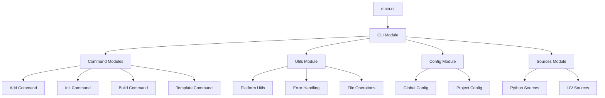

# 🎯 OpenRye Rust Teaching Summary
## Executive Guide for Instructors

---

## 📊 **Codebase Statistics**

- **Total Rust Files**: ~50+ modules
- **Lines of Code**: ~15,000+ lines
- **Dependencies**: 40+ external crates
- **Architecture**: Modular CLI application
- **Rust Edition**: 2021
- **MSRV**: 1.70+

---

## 🏗️ **Architecture Overview**



---

## 🎓 **Key Teaching Points**

### 1. **Module System**
- **Visibility**: `pub`, `pub(crate)`, private
- **Organization**: One module per command
- **Re-exports**: Strategic use of `pub use`

### 2. **Error Handling**
```rust
// Pattern 1: Anyhow for flexibility
use anyhow::{Result, Context, bail};

// Pattern 2: Custom errors with thiserror
#[derive(Debug, thiserror::Error)]
enum CustomError { /* ... */ }

// Pattern 3: Error propagation with ?
fn operation() -> Result<()> {
    risky_op().context("Failed to perform operation")?;
    Ok(())
}
```

### 3. **CLI with Clap**
```rust
#[derive(Parser)]
struct Args {
    #[command(subcommand)]
    command: Command,
}

#[derive(Subcommand)]
enum Command {
    Init(InitArgs),
    Build(BuildArgs),
}
```

### 4. **Traits & Generics**
```rust
trait CommandExecutor {
    type Args;
    fn execute(args: Self::Args) -> Result<()>;
}
```

### 5. **Concurrency Patterns**
- **Atomics** for global state
- **Channels** for communication (future)
- **Async/Await** (to be implemented)

---

## 🔄 **Code Flow Analysis**

### **Initialization Flow**:
1. `main()` → Set panic handler
2. Configure Ctrl+C handler
3. Initialize platform-specific code
4. Load configuration
5. Parse CLI arguments (Clap)
6. Dispatch to command handler
7. Execute command logic
8. Handle errors gracefully

### **Command Execution Pattern**:
```rust
pub fn execute(args: Args) -> Result<()> {
    // 1. Validate arguments
    validate_args(&args)?;
    
    // 2. Load/prepare context
    let context = prepare_context()?;
    
    // 3. Perform operation
    perform_operation(&context, &args)?;
    
    // 4. Clean up if needed
    cleanup()?;
    
    Ok(())
}
```

---

## 💡 **Rust Idioms Demonstrated**

### 1. **Builder Pattern**
- Used via Clap derives
- Could be expanded for complex objects

### 2. **Type State Pattern**
- Implicit in command structure
- Could be made explicit

### 3. **RAII (Resource Acquisition Is Initialization)**
- Automatic cleanup via `Drop`
- File handles, temp directories

### 4. **Zero-Cost Abstractions**
- Heavy use of generics
- Compile-time polymorphism

### 5. **Error Propagation**
- Extensive use of `?` operator
- Context addition with `.context()`

---

## 📈 **Improvement Roadmap**

### **Phase 1: Code Quality**
- [ ] Add comprehensive tests
- [ ] Implement clippy lints
- [ ] Add benchmarks
- [ ] Improve documentation

### **Phase 2: Architecture**
- [ ] Extract core library
- [ ] Implement plugin system
- [ ] Add async/await
- [ ] Create trait abstractions

### **Phase 3: Features**
- [ ] AI integration
- [ ] REST API
- [ ] WebAssembly support
- [ ] Distributed builds

### **Phase 4: Innovation**
- [ ] ML-powered dependency resolution
- [ ] Intelligent caching
- [ ] Code generation
- [ ] Rust-Python interop

---

## 📚 **Curriculum Modules**

### **Module 1: Rust Basics**
- Variables and ownership
- Structs and enums
- Pattern matching
- Error handling

### **Module 2: CLI Development**
- Clap framework
- Argument parsing
- Subcommands
- Help generation

### **Module 3: File I/O & Serialization**
- Path manipulation
- File operations
- JSON/TOML handling
- Binary formats

### **Module 4: External Process Management**
- Command execution
- Pipe handling
- Signal management
- Platform differences

### **Module 5: Testing & Documentation**
- Unit tests
- Integration tests
- Doc tests
- Benchmarking

### **Module 6: Advanced Patterns**
- Traits and generics
- Lifetime management
- Unsafe code
- FFI

---

## 🎯 **Learning Outcomes**

Students will be able to:
1. **Design** modular Rust applications
2. **Implement** robust error handling
3. **Build** command-line interfaces
4. **Write** cross-platform code
5. **Test** Rust applications effectively
6. **Document** code properly
7. **Optimize** performance
8. **Integrate** with other languages

---

## 🛠️ **Hands-On Exercises**

### **Exercise 1: Add a New Command**
**Objective**: Understand command structure
```rust
// Create src/cli/stats.rs
// Implement statistics command
// Wire into CLI system
```

### **Exercise 2: Implement Caching**
**Objective**: File I/O and serialization
```rust
// Create cache module
// Implement save/load
// Add TTL support
```

### **Exercise 3: Add Progress Bars**
**Objective**: User interface enhancement
```rust
// Use indicatif crate
// Add to long operations
// Make configurable
```

### **Exercise 4: Create Plugin System**
**Objective**: Advanced architecture
```rust
// Design plugin trait
// Implement loading
// Create example plugin
```

### **Exercise 5: Add Async Support**
**Objective**: Concurrent programming
```rust
// Convert command to async
// Add tokio runtime
// Implement parallel operations
```

---

## 🔍 **Code Review Checklist**

### **Safety**
- [ ] No `unwrap()` in production
- [ ] Proper error handling
- [ ] Thread safety considered
- [ ] Memory leaks prevented

### **Quality**
- [ ] Tests included
- [ ] Documentation complete
- [ ] Clippy warnings fixed
- [ ] Formatting consistent

### **Performance**
- [ ] Efficient algorithms
- [ ] Minimal allocations
- [ ] Lazy evaluation used
- [ ] Benchmarks provided

### **Maintainability**
- [ ] Clear naming
- [ ] Single responsibility
- [ ] DRY principle
- [ ] SOLID principles

---

## 🚀 **Next Steps for Students**

1. **Fork the repository**
2. **Choose an exercise**
3. **Implement solution**
4. **Write tests**
5. **Document changes**
6. **Submit PR for review**
7. **Iterate based on feedback**

---

## 📖 **Recommended Reading Order**

1. `main.rs` - Entry point
2. `cli/mod.rs` - CLI structure  
3. `cli/init.rs` - Command example
4. `utils/mod.rs` - Utility patterns
5. `config.rs` - Configuration management
6. `error.rs` - Error handling
7. Tests - Testing patterns

---

## 🎨 **Design Patterns to Study**

1. **Command Pattern** - CLI commands
2. **Builder Pattern** - Via Clap
3. **Strategy Pattern** - Platform-specific code
4. **Factory Pattern** - Command creation
5. **Adapter Pattern** - External tool integration

---

## 💭 **Discussion Topics**

1. **Why Rust for CLI tools?**
   - Performance
   - Safety
   - Single binary distribution
   - Cross-platform

2. **Error handling strategies**
   - Result vs panic
   - Error propagation
   - User-friendly messages

3. **Testing strategies**
   - Unit vs integration
   - Mocking external dependencies
   - Property-based testing

4. **Performance considerations**
   - Compile time vs runtime
   - Memory usage
   - Startup time

---

## 🏆 **Mastery Indicators**

Students have mastered the material when they can:
- ✅ Add new commands independently
- ✅ Implement proper error handling
- ✅ Write comprehensive tests
- ✅ Debug issues effectively
- ✅ Optimize performance
- ✅ Document code properly
- ✅ Review others' code
- ✅ Design new features

---

## 📝 **Assessment Ideas**

1. **Project**: Implement a new major feature
2. **Code Review**: Review and improve existing code
3. **Performance**: Optimize a slow operation
4. **Testing**: Achieve 80% test coverage
5. **Documentation**: Write a tutorial

---

## 🌟 **Final Thoughts**

OpenRye provides an excellent real-world codebase for teaching Rust because it:

- **Is production-quality** - Not a toy example
- **Has real complexity** - Multiple concerns
- **Shows patterns** - Common Rust idioms
- **Has room for improvement** - Learning opportunities
- **Is actively maintained** - Modern Rust
- **Solves real problems** - Practical application

Students studying this codebase will gain practical experience that directly transfers to professional Rust development.

---

## 📧 **Instructor Resources**

- **Slides**: Available in `/curriculum/slides/`
- **Solutions**: In `/curriculum/solutions/`
- **Tests**: In `/curriculum/tests/`
- **Videos**: Links in `/curriculum/videos.md`

---

*This curriculum is designed to take students from intermediate Rust knowledge to production-ready skills through hands-on exploration of a real-world codebase.*